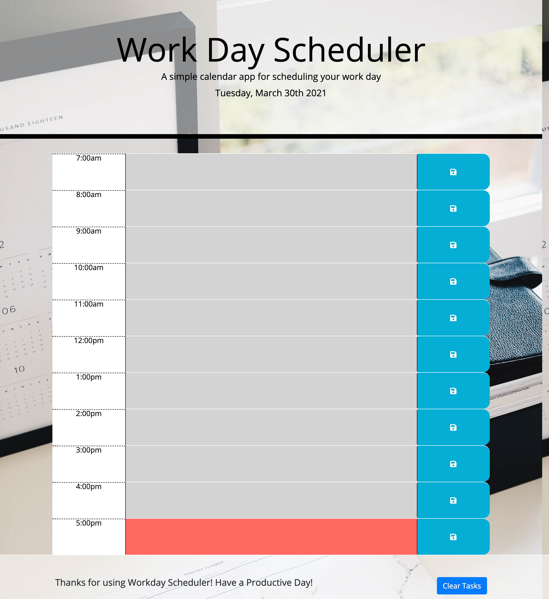

# Workday-Scheduler

## Description
This application is a simple daily planner application that allows a user to save events for each hour of the day. This application runs in the browser and features dynamically updated HTML and CSS powered by jQuery. Time elements are controled by Moment.js.

### Functional Elements:
* When the page loads, the current date is displayed in the header
* Time blocks are presented from the hours of 7am to 5pm
* Each time block is color coded to indicate whether the hour is in the past, present, or future
    * past- grey
    * present - red
    * future - green
* When the user types a task into the text box for the hour and clicks the save button, the text is saved in local storage
* When the page is refreshed the tasks continue to show
* At the bottom of the page, there is a clear button which clears local storage and reloads the page

## Usage
Deployed link to live site can be found at: https://suejinkim20.github.io/Workday-Scheduler/

The page has the following appearance:

## Credits

Original source code from UNC Boot Camp, Homework 5.

* Tutorials used:
    * https://www.w3schools.com/js/default.asp
    * https://developer.mozilla.org/en-US/docs/Web/JavaScript
    * https://www.w3schools.com/jquery/
    * https://momentjs.com/
    * https://api.jquery.com/

## License

MIT License

Copyright (c) [2021] [Sue Jin Kim]

Permission is hereby granted, free of charge, to any person obtaining a copy of this software and associated documentation files (the "Software"), to deal in the Software without restriction, including without limitation the rights to use, copy, modify, merge, publish, distribute, sublicense, and/or sell copies of the Software, and to permit persons to whom the Software is furnished to do so, subject to the following conditions:

The above copyright notice and this permission notice shall be included in all copies or substantial portions of the Software.

THE SOFTWARE IS PROVIDED "AS IS", WITHOUT WARRANTY OF ANY KIND, EXPRESS OR IMPLIED, INCLUDING BUT NOT LIMITED TO THE WARRANTIES OF MERCHANTABILITY, FITNESS FOR A PARTICULAR PURPOSE AND NONINFRINGEMENT. IN NO EVENT SHALL THE AUTHORS OR COPYRIGHT HOLDERS BE LIABLE FOR ANY CLAIM, DAMAGES OR OTHER LIABILITY, WHETHER IN AN ACTION OF CONTRACT, TORT OR OTHERWISE, ARISING FROM, OUT OF OR IN CONNECTION WITH THE SOFTWARE OR THE USE OR OTHER DEALINGS IN THE SOFTWARE.